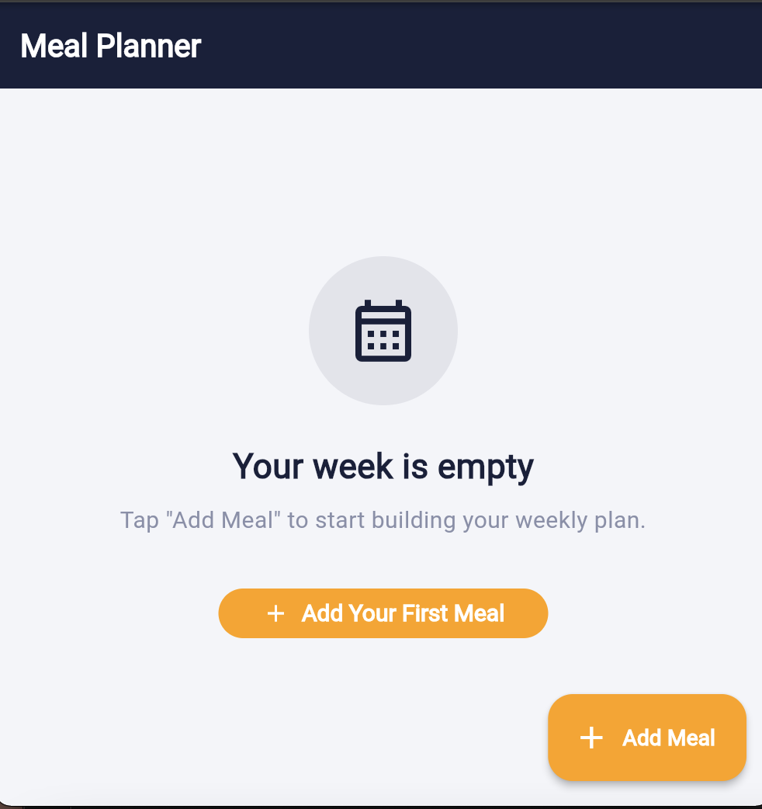
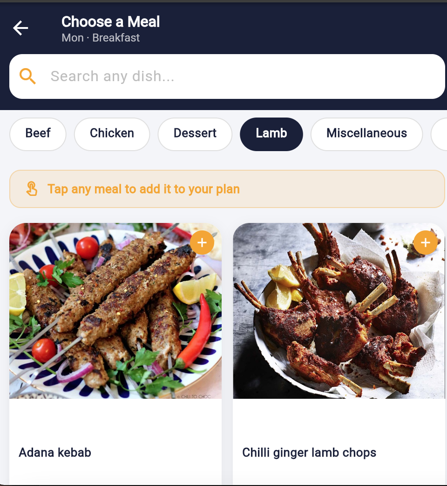
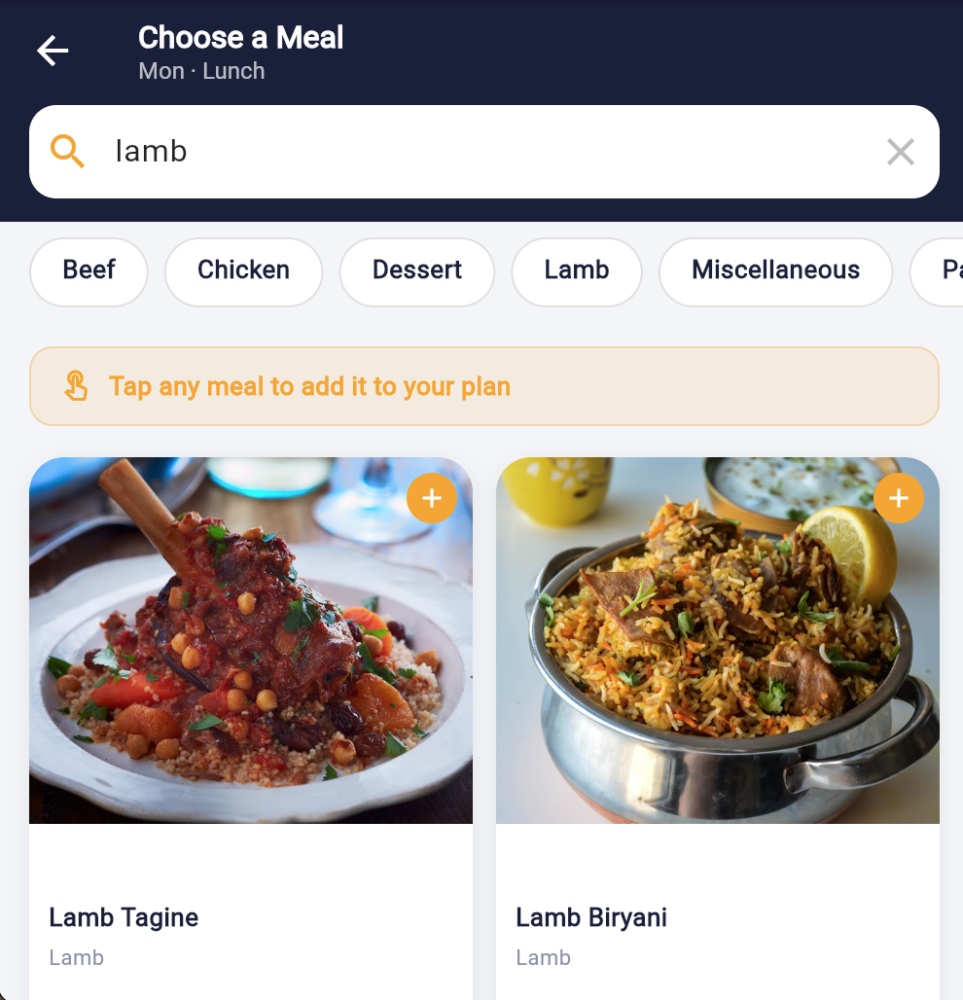
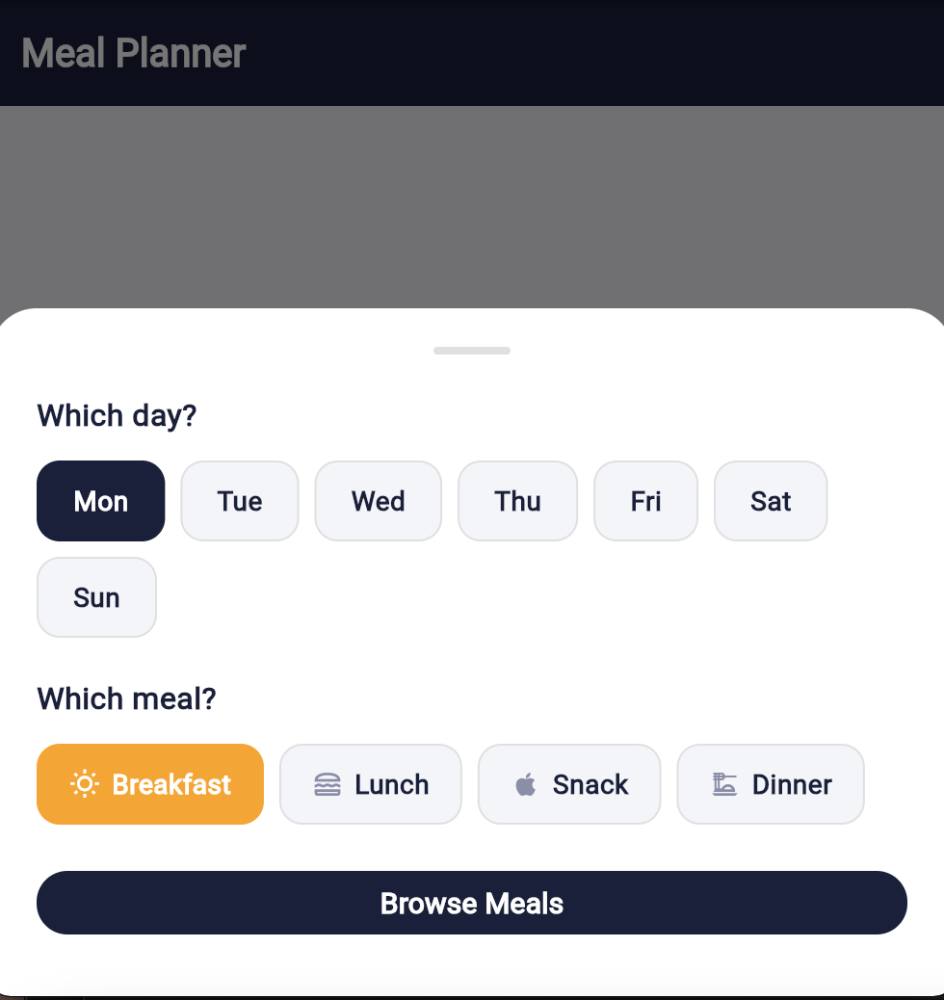
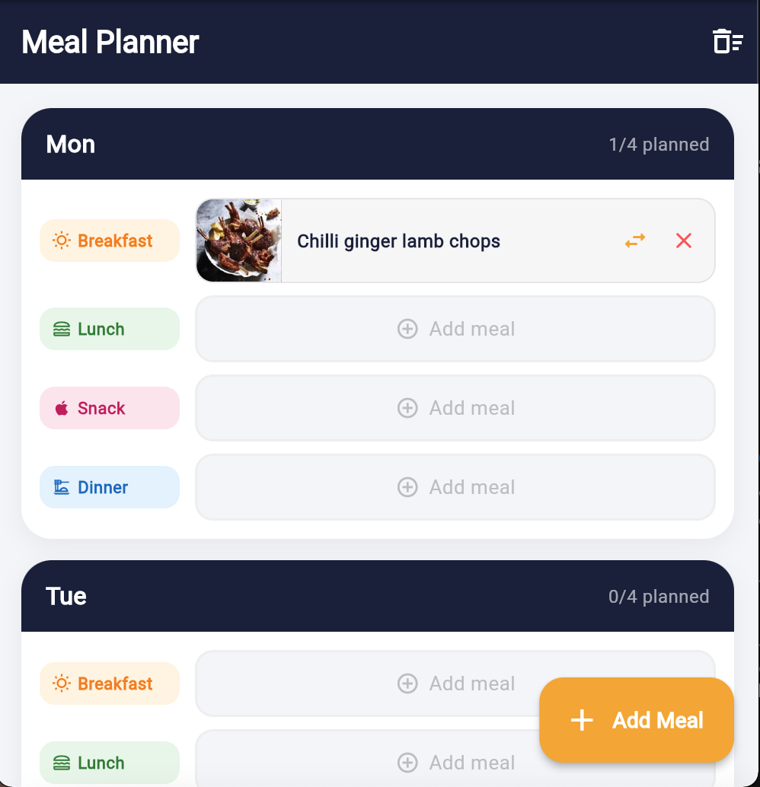
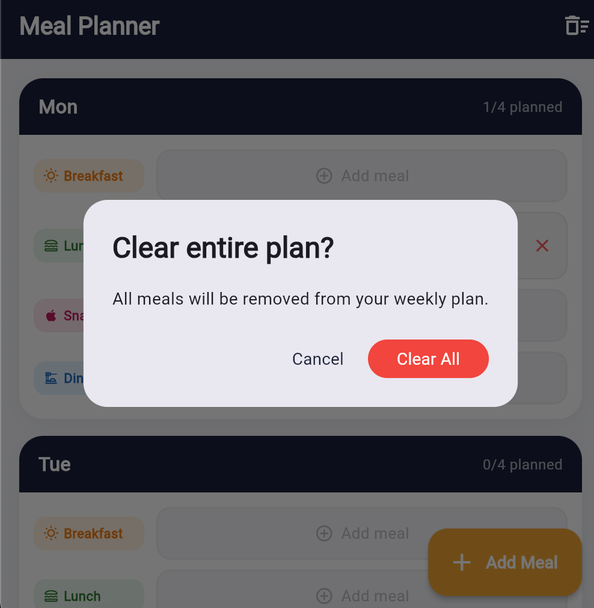
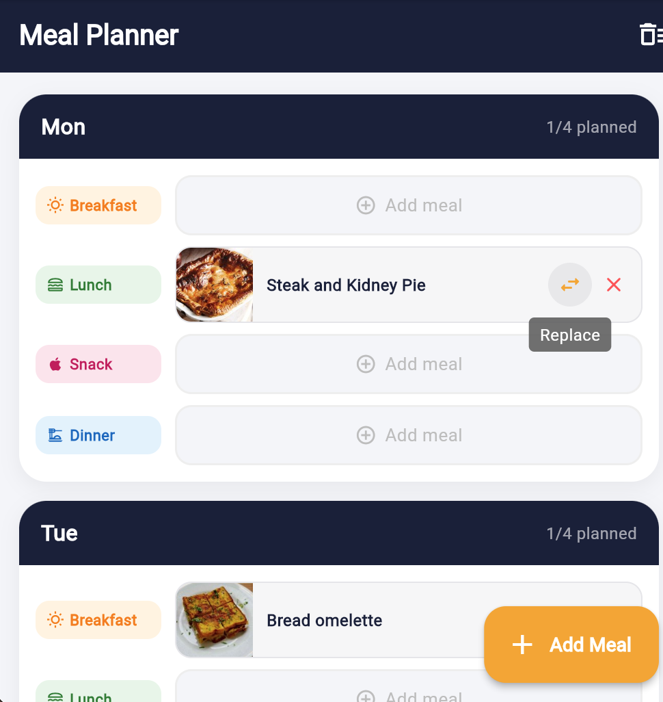
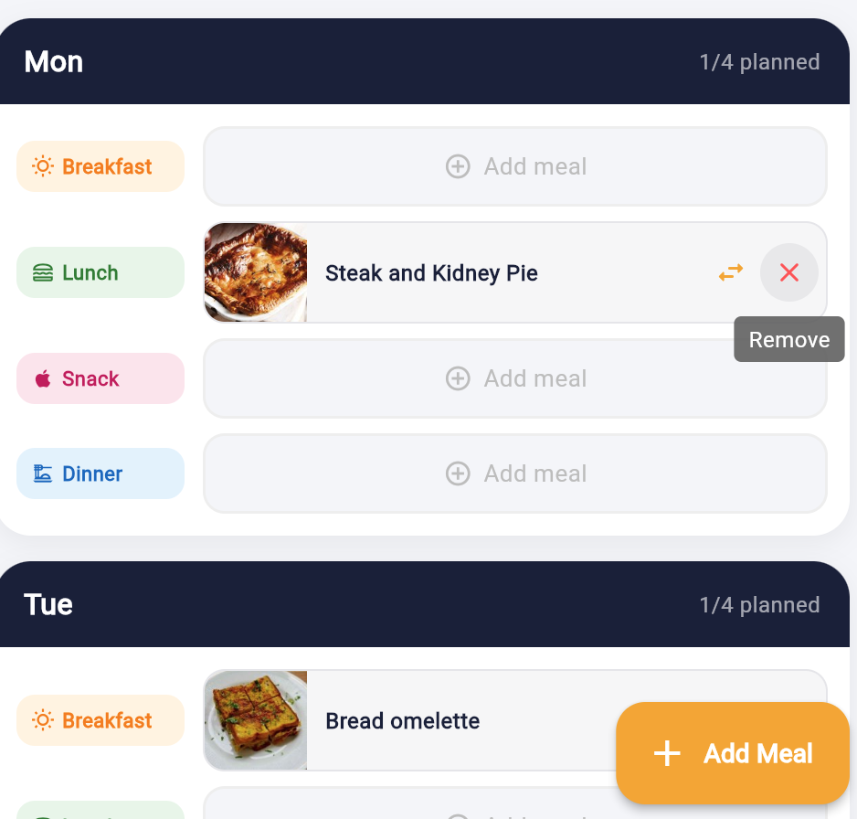
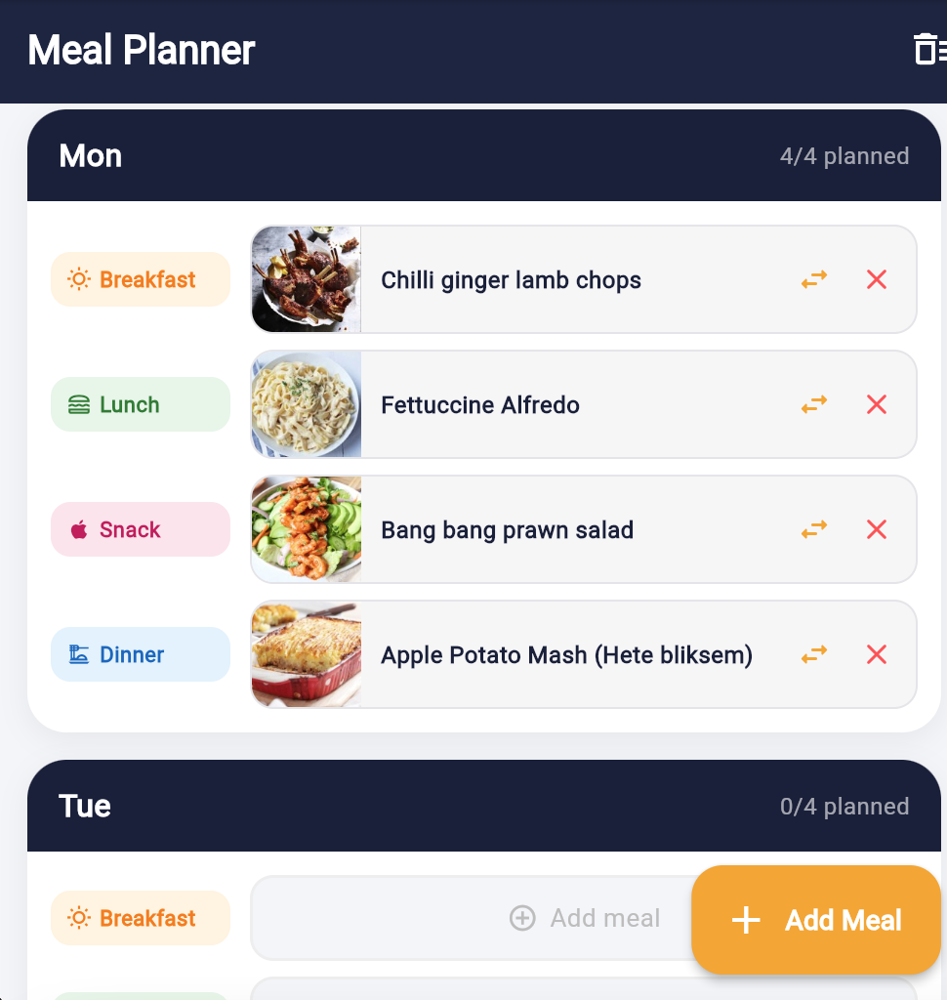
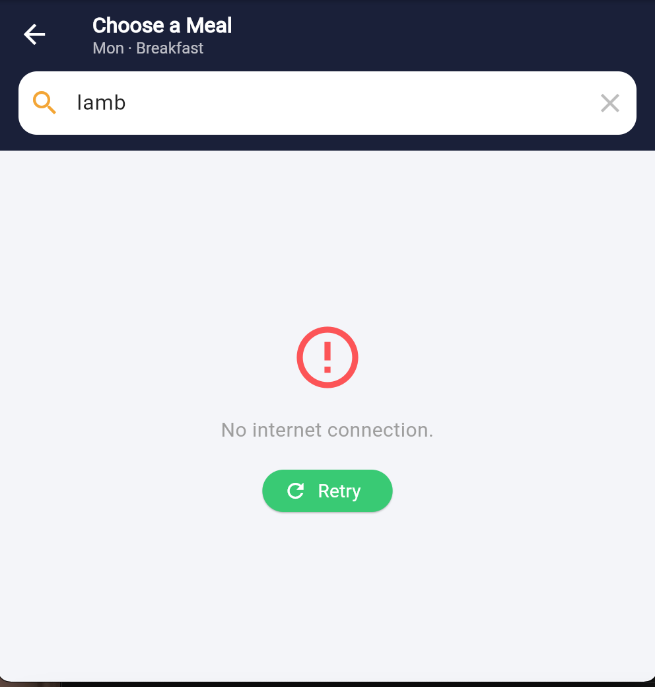

# Meal Planner

A Flutter meal planning application built using Bloc state management and Dio for API consumption.

## Features

- Browse meals from API
- Create meal plans
- Edit planned meals
- Delete meal plans
- View meal details
- Loading and error handling

## Technologies Used

- Flutter
- Bloc
- Dio
- REST API

## Screenshots

## Homescreen

#

#

#
## Detail screen

#

#

#

#

#

#

#
## Error handling

